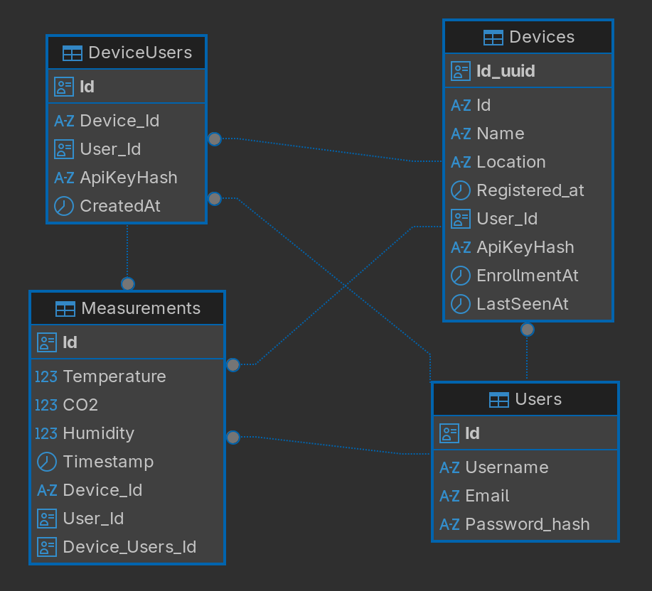

# Arduino Carbon Dioxide Meter

📟 **Arduino Carbon Dioxide Meter** is a DIY project for measuring indoor CO₂ levels using an Arduino microcontroller and a gas sensor (e.g., MH-Z19, CCS811, or similar).
The project helps monitor air quality, reminding you to ventilate the room and maintain a healthy CO₂ concentration.

## Features

- Measure CO₂ concentration in ppm (parts per million).
- Display data on LCD/OLED screen.
- LED indication (green — normal, yellow — medium, red — high).
- Send sensor data from Arduino to the server.
- View history and statistics via a web interface.

## Hardware Components

- Arduino Uno / Nano / Mega (any compatible microcontroller).
- CO₂ sensor (recommended MH-Z19B or similar).
- LCD 16x2 or OLED display (optional).
- LEDs and resistors for indication.
- Breadboard and jumper wires.

## Project Architecture

The project is divided into three main parts:

### 🔌 Arduino (Hardware Layer)

- Reads CO₂ data from the sensor.
- Sends data via Serial/USB or Wi-Fi (ESP module) to the server.

### 🖥️ Backend (C# / ASP.NET Core)

- Receives sensor data from Arduino.
- Stores CO₂ values in a database.
- Provides REST API for the frontend.

### 🌐 Frontend (React)

- Displays real-time CO₂ levels.
- Graphs for monitoring changes over time.
- Visual alerts for normal/critical values.
- User-friendly web dashboard.

## Use Cases

- Indoor air quality monitoring (home, office, classroom).
- Helps maintain proper ventilation.
- Educational project for learning Arduino, C#, React, and IoT basics.

## Arduino Settings

- **Drivers:** [link](https://www.silabs.com/software-and-tools/usb-to-uart-bridge-vcp-drivers?tab=downloads)
- **Board:** ESP32-WROOM-DA Module
- **Board downloading:** esp32

## Entity-Relationship Diagram



## To run Frontend

```bash
cd frontend
npm install

npm start
```

## To run Backend

```bash
cd backend
dotnet run
```

Create a `.env` file in `backend/` directory and paste your dates.

ENV Example
```env
# Database
HOST=your_host
DPORT=db_port
DATABASE=db_name
USER=db_user
PASSWORD=db_password

# Contacts
EMAIL_ADDRESS=your_email_address
EMAIL_PASSWORD=your_email_password

# Swagger basic auth
SWAGGER_ADMIN_LOGIN=login_name
SWAGGER_ADMIN_PASSWORD=super_strong_password

# CORS (фронт)
ALLOWED_FRONTEND_PORT=your_frontend_port

# PORT
PORT=your_running_port
```

## What is ready?
🔌 Arduino Layer

- ✅ ESP32 is connected and successfully reads CO₂ data from the MH-Z19B sensor.

- ✅ LED indicators visualize CO₂ level ranges.

- ✅ LED self-test function implemented.

- ⚙️ In progress — sending sensor data to the backend via Wi-Fi (HTTP request).

🖥️ Backend (ASP.NET Core / C#)

- ✅ Implemented Controllers: Devices, Measurements, Contacts, Auth.
    - Devices: 
        - `HttpGet("id/{deviceId}")`, 
        - `HttpGet("user/{userId:guid}")`, 
        - `HttpPost("register")`
    - Auth:
        - `HttpPost("login")`, 
        - `HttpPost("register")`
    - Measurements: 
        - `HttpGet("measurements/{deviceId}")`, 
        - `HttpGet("measurements/recent")`, 
        - `HttpGet("measurements/{deviceId}/latest")`, 
        - `HttpPost("measurements")` // register
    - Contacts: 
        - `[HttpPost] SendMessage`
- ✅ Health check endpoint /health (used as initial Cloudflare Tunnel endpoint).

